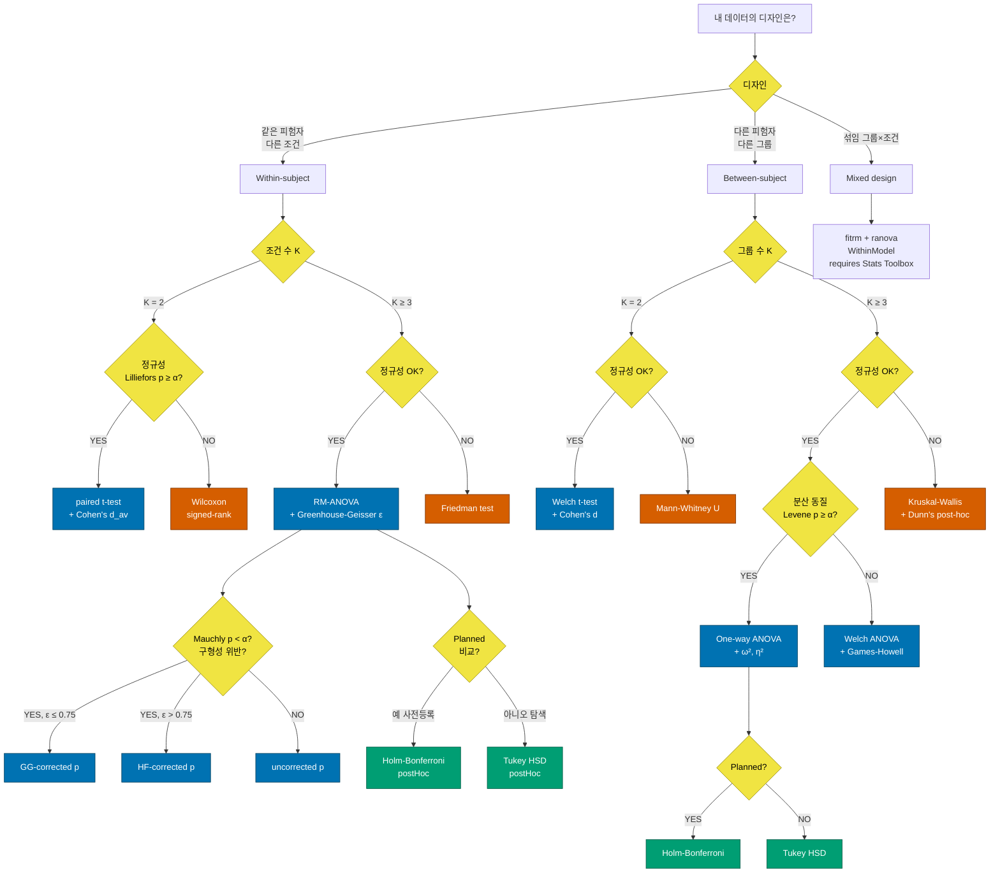

# 통계 검정 결정 트리

> "내 데이터에 어떤 통계 검정을 써야 하지?"
> H-Walker / 일반 보행 재활 연구용 결정 가이드.

---

## 자동 추천 — 한 줄

```matlab
rec = hwalker.stats.decisionTree(groups, 'Design', 'between');
disp(rec.rationale);
```

`decisionTree` 가 정규성 (Lilliefors), 분산 동질성 (Brown-Forsythe Levene)
을 자동 체크 후 적합 검정 + 사후검정 method 까지 추천합니다.

아래 트리는 그 추천 로직의 시각화입니다.

---

## Mermaid 결정 트리



---

## 검정별 효과 크기 (논문 필수 보고)

| 검정 | 효과 크기 | 함수 / 계산 | 작은-중간-큰 |
|---|---|---|---|
| paired t | `d_av` (Cumming 2012) | `r.cohens_d_variants.d_av` | 0.2 / 0.5 / 0.8 |
| paired t | `d_z` (Cohen 1988) | `r.cohens_d_variants.d_z` | 0.2 / 0.5 / 0.8 |
| Welch t | `d_s` (pooled SD) | 직접 계산 | 0.2 / 0.5 / 0.8 |
| Mann-Whitney | `r = Z / √N` | 직접 계산 | 0.1 / 0.3 / 0.5 |
| One-way ANOVA | `ω²` (less biased) | `a.omega2` | 0.01 / 0.06 / 0.14 |
| One-way ANOVA | `η²` | `a.eta2` | 0.01 / 0.06 / 0.14 |
| One-way ANOVA | Cohen's `f` | `a.cohens_f` | 0.10 / 0.25 / 0.40 |
| RM-ANOVA | partial `η²` | `a.eta2_partial` | 0.01 / 0.06 / 0.14 |
| RM-ANOVA | generalized `η²` (Olejnik 2003) | `a.eta2_generalized` | (권장 보고) |

---

## 다중 비교 보정 — 어떤 method?

| Method | 통제 대상 | 강도 | 언제 |
|---|---|---|---|
| `bonferroni` | FWER (family-wise) | 가장 보수적 | 비교 수 적고 (≤5) 사전 등록 |
| `holm` | FWER | 보수적 | Bonferroni 의 sequential 개선; 권장 default |
| `tukey` | FWER (균형 설계) | 중간 | All pairwise + 동일 n; 탐색적 분석 |
| `fdr` (BH) | FDR (false discovery rate) | 가장 약함 | 다수 비교 (≥10), exploratory |

```matlab
ph = hwalker.stats.postHoc(groups, 'Method', 'holm', ...
                                    'GroupNames', {'baseline','low','high'});
disp(table(ph.pair_labels, ph.mean_diff, ph.p_raw, ph.p_adj, ph.reject, ...
    'VariableNames', {'pair','diff','p_raw','p_adj','reject'}));
```

---

## 가정 위반 시 대안 (Robust 분석)

| 가정 | 위반 시 대안 |
|---|---|
| 정규성 (paired) | Wilcoxon signed-rank → `signrank()` 또는 `pairedTest` (둘 다 보고) |
| 정규성 (independent) | Mann-Whitney U → `ranksum()` |
| 정규성 (ANOVA) | Kruskal-Wallis → `kruskalwallis()` |
| 정규성 (RM-ANOVA) | Friedman → `friedman()` |
| 분산 동질성 (between) | Welch ANOVA → `anova1(...,'off')` + Welch correction |
| 구형성 (RM-ANOVA) | Greenhouse-Geisser ε 자동 적용 → `r.recommended_p` |
| 분포 임의 (CI 필요) | BCa-bootstrap → `hwalker.stats.bootstrap(x, @stat)` |

---

## 보고 양식 — 저널 수준

### Paired t-test
> "Stride time was significantly reduced after training (M_pre = 1.18 ± 0.09 s,
> M_post = 1.10 ± 0.08 s; **t(11) = 4.32, p = .001, Cohen's d_av = 0.95**, 95% CI
> of difference [0.04, 0.12])."

`hwalker.stats.pairedTest` 결과 struct 의 `t_stat`, `df_ttest`, `p_ttest`,
`cohens_d_variants.d_av`, `ci_diff` 가 정확히 위 양식을 채웁니다.

### One-way ANOVA + Tukey
> "Cadence differed across assistance levels (**F(2, 27) = 8.74, p < .001,
> ω² = 0.34**). Tukey HSD revealed that high-assist (M = 108.4 ± 5.2) was
> significantly higher than baseline (M = 101.6 ± 4.8; **p_adj = .002,
> 95% CI [3.1, 10.5]**)."

### RM-ANOVA + GG
> "Stride time differed across conditions (RM-ANOVA, sphericity rejected by
> Mauchly's test, W = .42, p = .03; Greenhouse-Geisser ε = .68 applied:
> **F(1.36, 13.6) = 12.4, p = .002, η²_p = 0.55**)."

---

## Sample size / Power planning (앞으로 추가 예정)

`hwalker.stats.power.*` 모듈은 Phase F 에 포함 예정. 현재는 G*Power 로 외부 계산:

| 검정 | G*Power Test family | Statistical test |
|---|---|---|
| paired t | t tests | Means: Difference between two dependent means |
| 1-way ANOVA | F tests | ANOVA: Fixed effects, omnibus, one-way |
| RM-ANOVA | F tests | ANOVA: Repeated measures, within factors |

---

*이 결정 트리는 `hwalker.stats.decisionTree` 의 자동 추천과 일치하며,
인터랙티브 버전은 `frontend/public/docs/decision_tree.html` 에 있습니다.*
